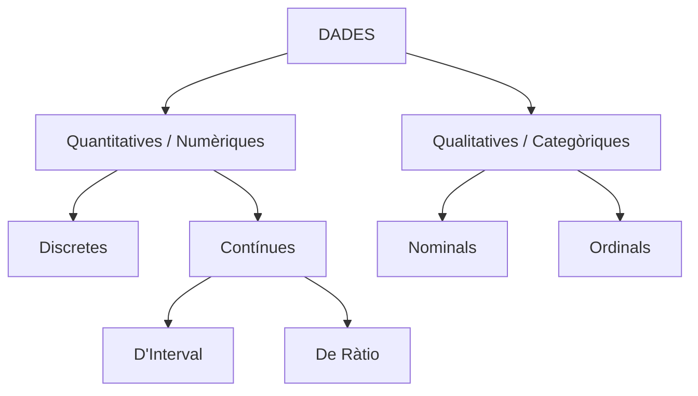
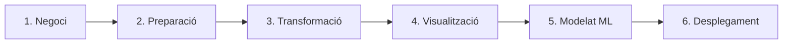

# M5074: Ciència de Dades, Metodologies i Dades a l'Empresa

Aquest dipòsit conté els apunts estructurats, ampliats i resums del mòdul **M5074**, cobrint des dels conceptes fonamentals de les dades fins a les metodologies de ciència de dades, l'arquitectura d'equips i la seva aplicació estratègica en l'entorn empresarial.

---

## 1. Introducció als Conceptes de Dades

### 1.1. Definicions i Importància
* **Dades**: Qualsevol col·lecció d'informació (fets, xifres, text, imatges) que es pot recopilar, processar, analitzar i interpretar per extreure'n coneixement i prendre decisions basades en evidències.
* **Valor per als negocis**: Actiu estratègic que permet optimitzar la presa de decisions, millorar processos operatius, personalitzar l'experiència del client, reduir costos, augmentar beneficis i crear nous models de negoci.
* **Impacte social**: ONG, governs i institucions utilitzen el *Data for Good* per abordar reptes globals com el canvi climàtic, la gestió de pandèmies, l'optimització del transport públic i la reducció de la pobresa.
* **Volum actual**: Generació exponencial de dades (aproximadament 2,5 trilions de bytes diaris i una previsió de creixement global superior als 180 zettabytes per al 2026) impulsada per dispositius IoT, xarxes socials i transaccions digitals.

---

### 1.2. Data Analysis vs. Data Analytics

* **Data Analysis**
  * **Enfocament:** Reactiu / Explicatiu / Diagnòstic.
  * **Temporalitats / Objectiu:** **Passat:** Examina, neteja, transforma i explora dades històriques per respondre preguntes específiques sobre què va passar i per què va passar.
  * **Exemple:** Analitzar les vendes passades d'entrades de cinema per trobar patrons de consum segons el dia de la setmana o el gènere de la pel·lícula.

* **Data Analytics**
  * **Enfocament:** Proactiu / Predictiu / Prescriptiu.
  * **Temporalitats / Objectiu:** **Futur:** Aplica algorismes, estadística avançada i processos sistemàtics per identificar tendències, fer prediccions contínues i recomanar accions d'optimització.
  * **Exemple:** Utilitzar modelatge de dades i *Machine Learning* per predir la taquilla futura d'un film o optimitzar el preu de les entrades en temps real.

---

### 1.3. Classificació de les Dades

#### A. Segons l'Origen (Primàries vs. Secundàries)
* **Dades Primàries**: Recopilades directament per la mateixa organització o investigador per a un propòsit o projecte específic (ex. enquestes pròpies, experiments A/B, entrevistes).
  * *Avantatges*: Alta precisió, màxim control de qualitat i adaptabilitat exacta al problema.
  * *Limitacions*: Requereix un alt cost econòmic i molt temps d'execució.
* **Dades Secundàries**: Recollides prèviament per tercers o entitats externes (ex. dades de l'INE, informes governamentals, bases de dades obertes).
  * *Avantatges*: Disponibilitat immediata, baix cost i possibilitat d'analitzar grans volums d'històric.
  * *Limitacions*: Poden no ajustar-se exactament a la pregunta de negoci, contenir biaixos externs o estar desactualitzades.

#### B. Segons la Naturalesa (Quantitatives vs. Qualitatives)

1. **Dades Quantitatives** (Numèriques, mesurables i operables matemàticament):
* **Discretes**: Valors enters comptables sense valors intermedis (ex. nombre de fills, quantitat d'estudiants a l'aula).
* **Contínues**: Valors dins d'un rang continu que admeten decimals infinitament (ex. alçada, pes, temps).
* *D'Interval*: Punts equidistants en una escala però **sense zero absolut** arbitrari (ex. $0^\circ\text{C}$ no significa absència de temperatura).
* *De Ràtio*: Amb un **zero absolut real** que indica absència total de la propietat (ex. $0\text{ €}$ de saldo, $0\text{ kg}$ de pes).

2. **Dades Qualitatives** (Descriptives, categòriques i no numèriques):
* **Nominals**: Categories sense un ordre o jerarquia inherent (ex. gènere, estat civil, color preferit).
* **Ordinals**: Categories que tenen un ordre o una escala lògica definida (ex. nivells de satisfacció, rangs militars, nivells d'estudis).

#### C. Segons la Structura (Estructurades, Semiestructurades i No Estructurades)

* **Dades Estructurades**: Organitzades en taules amb files i columnes bé definides i tipus de dades fixos (RDBMS, SQL, CSV).
* *Pro/Contres*: Molt fàcils de consultar i analitzar, però poc flexibles davant canvis d'esquema.

* **Dades Semiestructurades**: No tenen estructura de taula rígida però contenen etiquetes o marcadors per organitzar els elements (JSON, XML, YAML).
* *Pro/Contres*: Flexibles i ideals per a l'intercanvi de dades web, tot i que requereixen parsers específics.

* **Dades No Estructurades**: Sense model de dades predefinit (text lliure, àudios, imatges, vídeos, PDF, xarxes socials).
* *Pro/Contres*: Representen el 80% de les dades del món i contenen gran riquesa, però requereixen eines avançades de Processament del Llenguatge Natural (NLP), Visió per Computador i eines Big Data per poder-ne extreure valor.

---

## 2. Dades a l'Empresa (Business Data)

### 2.1. Dades Internes vs. Externes

* **Dades Internes (Primàries)**: Generades per les operacions diàries de la pròpia empresa.

* *Àrees de procedència*: ERP (finances), CRM (vendes i clients), sistemes de RRHH, logs de servidors, analítica web.

* *Avantatges*: Altament rellevants, privades, confidencials, segures i amb control directe sobre la seva qualitat.

* **Dades Externes (Secundàries)**: Obtingudes de fonts fora de l'organització per complementar l'anàlisi.

* *Àrees de procedència*: Dades de govern o entitats públiques (Open Data), investigacions de mercat, proveïdors de dades (*Data Brokers*), informació meteorològica, benchmarking de la competència.

* *Avantatges*: Permeten contextualitzar el negoci, avaluar la competència i identificar noves oportunitats de mercat.

---

### 2.2. Mètodes de Recollida de Dades

#### A. Recollida Manual

* **Enquestes i Qüestionaris**: Formularis dissenyats per recollir respostes directes d'una mostra de població.

* **Entrevistes i Focus Groups**: Tècniques qualitatives per extreure opcions, opinions profundes i motivacions.

* **Observació Directa**: Registre sistemàtic del comportament dels usuaris en entorns reals o simulats.

#### B. Recollida Automatitzada (Instrumentació)

1. **Monitoratge Continu**: Captura ininterrompuda de dades en temps real (ex. sensors IoT de temperatura i vibració en línies de producció).

2. **Monitoratge per Intervals**: Captura programada en franges de temps determinades per estalviar recursos d'emmagatzematge i processament (ex. gravacions de seguretat o registres horaris).

3. **Basat en Esdeveniments (Event-Driven)**: S'activa únicament quan es produeix un fet específic o una anomalia (ex. alertes de fraus bancaris davant un pagament estranger).

4. **Seguiment Digital (Web/App Tracking)**: Recollida passiva d'esdeveniments d'interacció digital (clics, scroll, temps de permanència) mitjançant galetes o píxels de seguiment.

---

### 2.3. Segons la Comercialització i Ús

* **Dades Sindicades**: Recollides per empreses especialitzades que en venen la llicència d'ús a moltes entitats (ex. Nielsen per a audiències de TV). Tenen un cost moderat, però no ofereixen cap avantatge competitiu exclusiu.

* **Dades de Tercers (3rd Party Data)**: Adquirides a agregadors o *brokers* de dades. Són molt útils per a la segmentació en campanyes de màrqueting, però presenten riscos de complir amb les normatives de privacitat (GDPR).

* **Dades Personalitzades (Custom Data)**: Capturades i construïdes a mida per a un cas d'ús concret. Tene un cost molt elevat, però aporten un valor exclusiu i un fort avantatge competitiu (ex. l'algorisme de recomanació de Netflix).

---

### 2.4. Qualitat de les Dades (*Data Quality*)

Per garantir que les dades siguin aptes per a l'anàlisi, han de complir les dimensions bàsiques de qualitat:

* **Completitud**: Absència de valors nuls o registres faltants.
* **Consistència**: Absència de contradiccions entre diferents bases de dades.
* **Precisió**: Les dades reflecteixen fidelment la realitat del fenomen.
* **Actualitat (Timeliness)**: Les dades estan disponibles quan es necessiten i actualitzades.
* **Unicitat**: Absència de registres duplicats.

---

## 3. Ciència de Dades i Metodologies

### 3.1. Definició i Mètode

La **Ciència de Dades** és un camp interdisciplinari que combina el mètode científic, l'estadística, la programació avançada, la Intel·ligència Artificial (*Machine Learning*) i el coneixement del negoci per transformar dades en informació d'alt valor estratègic.

* **Metodologia d'Investigació Causal (Els 5 Per què)**:
* Tècnica analítica iterativa que consisteix a preguntar "Per què?" cinc vegades consecutives per anar més enllà dels símptomes superficials i trobar la causa arrel d'un problema tècnic o de negoci.

---

### 3.2. Metodologies Clàssiques de Data Mining

```mermaid
graph TD
    subgraph CRISP_DM ["CRISP-DM (Business First)"]
        C1[1. Business Understanding] --> C2[2. Data Understanding]
        C2 --> C3[3. Data Preparation]
        C3 --> C4[4. Modeling]
        C4 --> C5[5. Evaluation]
        C5 --> C6[6. Deployment]
        C5 -. Iteració .-> C1
    end

    subgraph KDD ["KDD (Data Refining)"]
        K1[1. Selecció] --> K2[2. Preprocessament]
        K2 --> K3[3. Transformació]
        K3 --> K4[4. Mineria de Dades]
        K4 --> K5[5. Interpretació / Avaluació]
    end

    subgraph SEMMA ["SEMMA (Model Focused)"]
        S1[1. Sample] --> S2[2. Explore]
        S2 --> S3[3. Modify]
        S3 --> S4[4. Model]
        S4 --> S5[5. Assess]
    end

```

* **CRISP-DM (Cross-Industry Standard Process for Data Mining)**: La metodologia estàndard més emprada a la indústria. És un procés **iteratiu i cíclic** que situa la comprensió del negoci al centre de tot desenvolupament.

* **KDD (Knowledge Discovery in Databases)**: Centrada principalment en les etapes matemàtiques i tècniques de neteja, preparació i extreure coneixement profund a partir de grans volums de dades.

* **SEMMA**: Desenvolupada per SAS, orientada especialment a la creació, refinament i avaluació tècnica de models d'aprenentatge automàtic.

---

### 3.3. Els 6 Passos de la Metodologia de Desenvolupament

1. **Comprensió del Negoci**: Definició precisa del problema, formulació d'hipòtesis, realització de tallers de *Design Thinking* i establiment de KPIs d'èxit del projecte.

2. **Homologació i Preparació de Dades**: Fase que consumeix entre el 70% i el 80% del temps del projecte. Inclou la recollida de fonts, la resolució de valors faltants, l'eliminació d'atípics (*outliers*) i la fusió de taules.

3. **Representació i Transformació de Dades**: Anàlisi d'estadística descriptiva i conversions numèriques (encoding de variables categòriques, escalat/normalització de variables, tokenització de text).

4. **Visualització i Presentació de Dades**: Generació de dashboards interactius i gràfics narratius (*Data Storytelling*) per validar la validesa de les hipòtesis inicials i comunicar troballes als responsables de la presa de decisions.

5. **Models de Dades (Entrenament de Machine Learning)**:
* **Aprenentatge Supervisat**: Algorismes que aprenen a partir de dades prèviament etiquetades (ex. classificació de correu brossa, predició de preus amb regressió).

* **Aprenentatge No Supervisat**: Algorismes que descobreixen patrons o estructures ocultes en dades sense etiquetar (ex. clustering per segmentació de clients, reducció de la dimensionalitat).

6. **Implementació i Desplegament de Models**: Puesta en producció dels models (mitjançant APIs, tasques batch o MLOps), integració amb els sistemes operatius de l'empresa i monitoratge continu per evitar la degradació del model (*model drift*).

---

### 3.4. Equip de Treball i Rols en Projectes de Dades

* **Analista de Dades (Data Analyst)**
* **Funció**: Recopila, neteja, organitza i analitza dades estructurades per extreure-ne conclusions tàctiques.

* **Eines típiques**: SQL, Excel avançat, Power BI, Tableau, Python/R (bàsic).

* **Científic de Dades (Data Scientist)**
* **Funció**: Formula hipòtesis complexes, explora dades heterogènies i dissenya algorismes de *Machine Learning* predictius.

* **Eines típiques**: Python (Pandas, Scikit-Learn, TensorFlow, PyTorch), R, Jupyter Notebooks, Spark.

* **Enginyer de Dades (Data Engineer)**
* **Funció**: Dissenya, construeix i manté l'arquitectura de dades, les canonades (*pipelines* ETL/ELT) i assegura la disponibilitat de les dades per a la resta de l'equip.

* **Eines típiques**: SQL, Python, Apache Spark, Kafka, Airflow, Docker, Plataformes Cloud (AWS, GCP, Azure).

* **Traductors de Negoci / Analytics Translator**
* **Funció**: Actua com a pont entre els equips tècnics de dades i els directius de negoci, traduint problemes comercials en requisits de dades.
